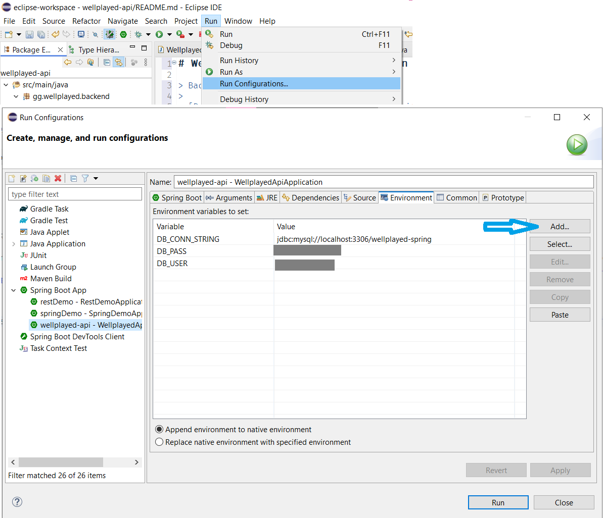

# WellPlayed: Backend: Java Edition

> Backend API para la aplicación WellPlayed
>
> [Repositorio índice del proyecto](https://github.com/Maig0l/proyecto-dsw)

## Setup

Antes de iniciar la aplicación, es importante definir las siguientes variables de entorno para poder conectarse a la base de datos:
- `DB_CONN_STRING`: Es la string de conexión, con host, puerto y nombre del schema a conectar. Ejemplo: `jdbc:mysql://localhost:3306/wellplayed-spring`
- `DB_USER`: Es el usuario de la DB con acceso a este schema.
- `DB_PASS`: Es la contraseña del usuario

Estas variables de entorno pueden guardarse en Eclipse en: `Run -> Run configurations... -> (pestaña) Environments`

